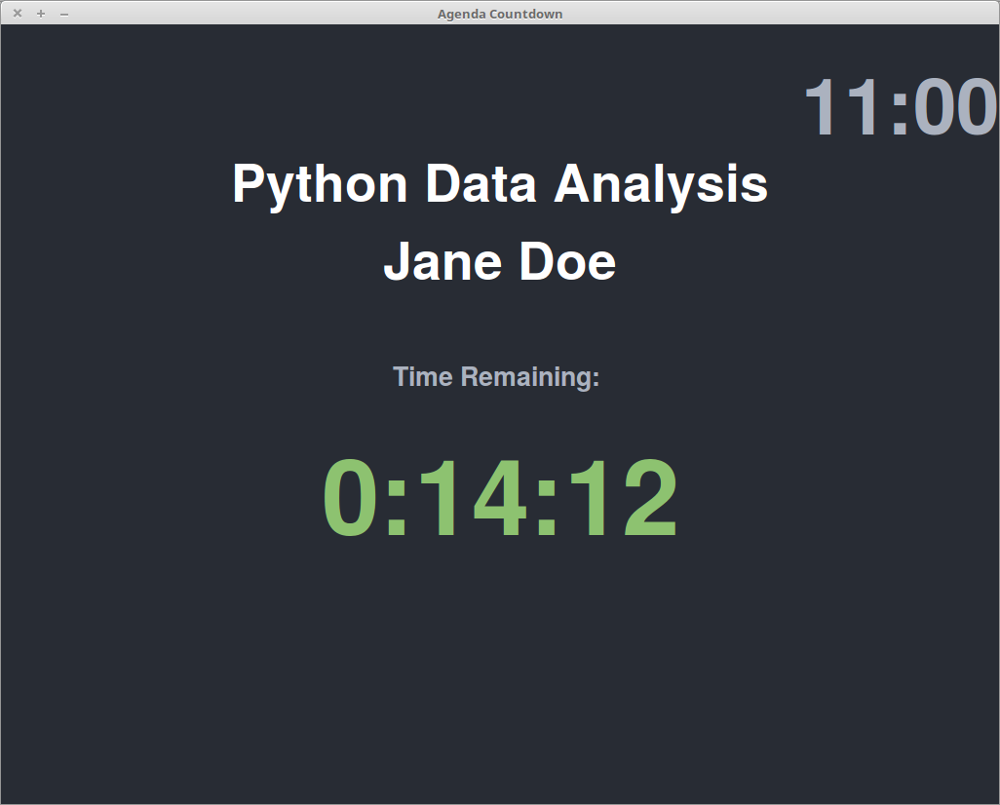

Agenda Timer
============
Python GUI to show conference or meeting agenda items with a time remaining countdown.
Created to show time remaining to each speaker for a Free/Open-Source conference in Belfast. 



Installation
------------
This python script makes use of Tkinter so you will want to ensure that Tkinter is installed on your
system. On a Debian/Ubuntu based system use:

```
sudo apt-get install git python3-tk

```
If you are using Windows or MacOS then you may wish to use the Python Anaconda installer to ensure you have all the 
Python libraries needed.

Then clone the repo:
```
git clone https://github.com/jonnymccullagh/agenda-timer.git
```

Usage
------------
To run the script cd into the agenda-timer folder and run with python3:
```
python3 agenda-timer.py

```
Use the keyboard keys 'Escape' or 'x' to quit the program.

## Customise the Agenda Times
To customise the session talks, speakers and timings edit the agenda.json file. The endtime field is used to determine when each session is due to end and is in the format YYYYmmDDHHMMSS so August 12th 2017 at 2:15pm would be represented as 20170812141500
The syntax of the agenda.json file must be valid or nothing will be shown when the program runs. 

## Customise the Colours
To customise the colours and set the program to run in fullscreen mode edit the agenda-timer.py file. There is a section near the top for changing the colors etc:
```
timeremaining_warning=240 
timeremaining_critical=180
fullscreen=False

color_bg="#282c34"
color_mute="#abb2bf"
color_green="#8dc270"
color_highlights="#ffffff"

```

Improvements
------------
The following improvements would be useful:
- Read the JSON file periodically from a URL so that changes can be made on-the-fly
- Label at the bottom to show the next upcoming agenda item 
- Create an Android version


